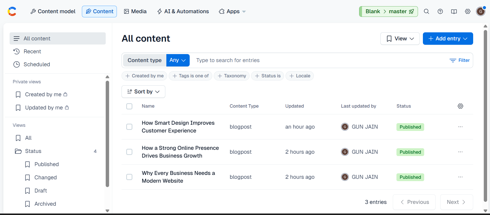

# My Blog — Next.js + Contentful Mini Marketing Site

> **Live URL:** (https://contentful-driven-marketing-website.vercel.app/)
>
> **GitHub Repo:** (https://github.com/Gunnjainn/Contentful-driven-marketing-website)

## Tech Stack

| Technology | Version |
|---|---|
| Next.js (App Router) | 16.1.6 |
| TypeScript | 5.x (strict mode) |
| Tailwind CSS | 4.x |
| Contentful CMS | 11.x |
| shadcn/ui | Card, Button, Badge |
| Vercel | Hosting & deployment |

## Pages

| Route | Description |
|---|---|
| `/` | Home page — hero section + latest 3 post preview cards |
| `/blog` | Blog list — responsive 2-column grid of all posts with badges |
| `/blog/[slug]` | Blog detail — full post with cover image, rich text, and SEO metadata |

## Setup

### 1. Clone the repository

```bash
git clone <(https://github.com/Gunnjainn/Contentful-driven-marketing-website)>
```

### 2. Install dependencies

```bash
npm install
```

### 3. Configure environment variables

Create a `.env.local` file in the project root:

```
CONTENTFUL_SPACE_ID=your_space_id
CONTENTFUL_ACCESS_TOKEN=your_access_token
```

### 4. Contentful content model

Create a content type called **blogpost** with these fields:

| Field | Type |
|---|---|
| `title` | Short text |
| `slug` | Short text |
| `excerpt` | Long text |
| `content` | Rich text |
| `coverImage` | Media (single image) |
| `publishDate` | Date & time |

### 5. Run the dev server

```bash
npm run dev
```

Open [http://localhost:3000](http://localhost:3000) in your browser.

## Contentful Model


!(contentful-model2.png)

## Project Structure

```
my-site/
├── src/
│   ├── app/
│   │   ├── layout.tsx              # Root layout with sticky navbar
│   │   ├── page.tsx                # Home page
│   │   ├── globals.css             # Tailwind + shadcn/ui + typography
│   │   └── blog/
│   │       ├── page.tsx            # Blog list page
│   │       ├── loading.tsx         # Skeleton loading state
│   │       └── [slug]/
│   │           └── page.tsx        # Blog detail page (SSG + ISR)
│   ├── components/
│   │   ├── RichTextRenderer.tsx    # Contentful rich text renderer
│   │   └── ui/                     # shadcn/ui components
│   │       ├── badge.tsx
│   │       ├── button.tsx
│   │       └── card.tsx
│   └── lib/
│       ├── contentful.ts           # Contentful client + data fetching
│       ├── types.ts                # Domain types (BlogPost, CoverImage)
│       └── utils.ts                # shadcn/ui utility (cn)
├── .env.local                      # Environment variables (not committed)
├── package.json
├── tsconfig.json
└── next.config.ts
```
